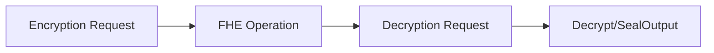

# Developer Documentation 👨‍💻

## 📋 Overview
1. What is CoFHE
2. Main Features
3. Uses
4. CTA: Getting Started Guide

## 🏗️ Architecture
> Includes comprehensive diagram with table content

### User-Facing Utilities
- CoFHE.js
- FHE.sol

### Internal Utilities
- TaskManager
- ACL
- Aggregator
- CTRegistry
- Verifier
- FheOs - Server
- Threshold Network
  - ZKPoK

### Data Flows

- Encryption Request Flow
- Request for FHE Operation
- Decryption Request
- Decrypt/SealOutput from FhenixJS

## 🔧 CoFHE.JS
> Including GitHub Repository Links

### **Installation Guide** (Setup Only)
### **Encryption Operations**
### **Sealing & Unsealing**
### **Permits Management**
### **Getting Started**
### **End-to-End Example**
### **Network Keys**
### **Error Handling**

## 📘 FHE Library (FHE.sol)
> Including GitHub Repository Links (CoFHE-Contracts)

### **Inputs**
### **Outputs**
   - Events
   - Returned Results
### **FHE Encrypted Operations**
### **Select vs If...else**
### **ACL Mechanism**
### **Randomness**
### **Decryption Operations**
### **Security Zones**
### **Gas and Benchmarks** 
    -At risk

## 💎 FHERC20
    - At risk 
    - Standard Implementation
    - Custom Features

## 📝 Tutorials
### **Getting Started**
### **Your First Confidential Smart Contract**
### **Migrating to CoFHE**
### **Local Development Setup**
    - W+ Threshold Network
    - W/o Threshold Network
### **Testing and Logging**
### **ACL Usage Examples**
### **Best Practices**

## 🛠️ SDK (Out of Scope)
- CoFHE.js Integration
- Browser-based Wallet SDK
- Browser-based Wallet UI Layout

## ⚠️Pay Attention
> Critical limitations and important considerations

### Common Issues
- FHE.sol Usage Problems
- Known Limitations
- Troubleshooting Guide

## Research and Publications

## Future Plans